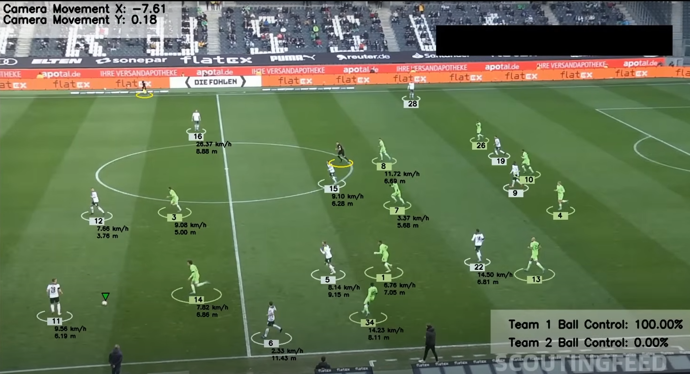

# Bundesliga Data Shootout



## Overview

This project analyzes the movement, speed, and ball control of players in a Bundesliga match, using real-time data visualizations and metrics. The goal is to evaluate team dynamics, track player performances, and analyze the tactical behavior of teams using data-driven insights.

## Features

- **Player Movement Tracking**: Analyze players' speed and distance covered throughout the match.
- **Ball Control Metrics**: Track ball possession and control percentages for each team.
- **Tactical Insights**: Visualize team formation and player positioning in real time.
- **Camera Tracking**: Adjust camera movements to synchronize with the analysis of the field.
- **Speed Visualization**: Visualize the speed of each player in km/h, along with the distance they have traveled during play.

## Technologies Used

- **Python**: Programming language used for data analysis and visualizations.
- **OpenCV**: For camera tracking and movement visualization.
- **Matplotlib**: Data visualization and plotting of graphs.
- **Pandas/Numpy**: Data manipulation and processing.

## Installation

1. Clone the repository:

    ```bash
    git clone https://github.com/your-username/DFL-Bundesliga-Data-Shootout.git
    ```

2. Navigate to the project directory:

    ```bash
    cd Bundesliga-Data-Shootout
    ```

3. Create a virtual environment (optional but recommended):

    ```bash
    python3 -m venv venv
    source venv/bin/activate  # On Windows use `venv\Scripts\activate`
    ```

4. Install the dependencies:

    ```bash
    pip install -r requirements.txt
    ```

## Contributing

If you'd like to contribute to this project:

1. Fork the repository.
2. Create a new branch (`git checkout -b feature-branch`).
3. Make your changes and commit them (`git commit -m 'Add new feature'`).
4. Push to the branch (`git push origin feature-branch`).
5. Create a Pull Request.

