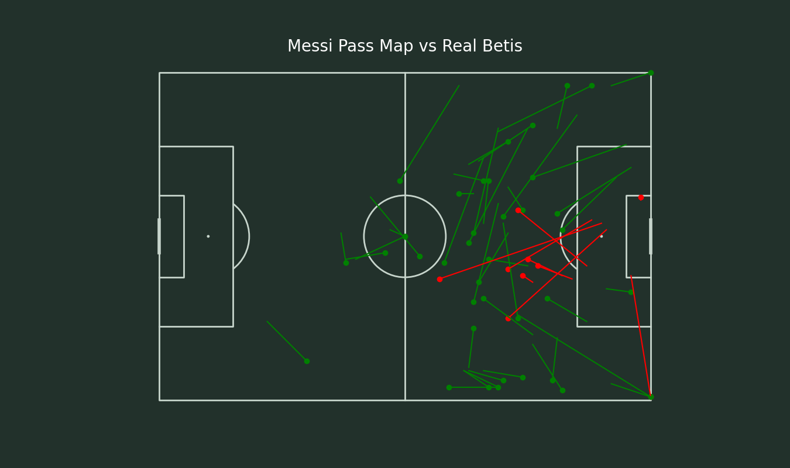

# Pass Map Visualization

This project focuses on creating football pass maps using **mplsoccer**. The pass map helps visualize player passes, displaying both successful and unsuccessful passes on a football pitch.

## Key Features

- **Custom Football Pitch**: A detailed football pitch design created using **mplsoccer**, customizable for different pitch types.
- **Pass Visualization**: The map highlights successful and unsuccessful passes, with successful passes shown in green and unsuccessful passes in red.
- **Inverted Axis**: For a typical broadcast-style view of the pitch, the axes are adjusted accordingly.

## Example Use Case

The pass map can be used to analyze specific matches, such as Lionel Messi's pass map against Real Betis, to understand his movement and passing tendencies during the game.

## Tools Used

- **mplsoccer**: A Python library for football analytics and visualization.
- **Matplotlib**: For plotting the pass map with customizable colors and styles.
